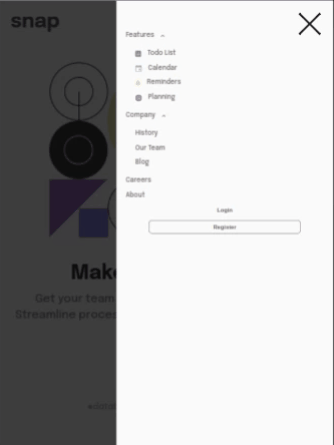

# Intro-section-with-dropdown-navigation-main

#### intro-section-with-dropdown-navigation-main é um desafio do Frontend Mentor com layouts um pouco mais complexos. O diferencial desse projeto é o menu dropdown. Obrigado por conferir meu código.

## Índice

- [Captura de tela](#captura-de-tela)
- [Links](#links)
- [Construído com](#construído-com)
- [O que aprendi](#o-que-aprendi)
- [Desenvolvimento contínuo](#desenvolvimento-contínuo)
- [Recursos úteis](#recursos-úteis)
- [Fernando Mendes](#autor)

### Captura de tela

<!-- #### Tela Desktop

 -->

#### Tela Ipad



#### Tela Mobile


### Links

- Site URL: https://nandosti.github.io/intro-section-with-dropdown-navigation-main/

### Construído com

<div style="display: inline_block"><br>
  
  
         
</div>

## O que aprendi

Nesse projeto envolvendo HTML,CSS e JS, aprendi conceitos importantes: criação de um menu dropdown; selecionar elementos DOM; selecionar elementos HTML; Uma novidade nos meus projetos é o uso do conceito de "Mobile First".

## Trechos de códigos

```
const menu = document.querySelector('.menu');
const dropdown = document.querySelectorAll('.dropdown');

menu.addEventListener('click', () => {
  menu.parentElement.classList.toggle('open');
  document.body.classList.toggle('nav-open');
});

dropdown.forEach(item => {
  item.addEventListener('click', () => {
    item.parentElement.classList.toggle('link-open');
  });
});

```

## Desenvolvimento contínuo

Pretendo continuar focado em construir um conhecimento sólido nessas tecnologias. Ainda há muitos conceitos importantes para serem desenvolvidos. Todos os dias aprendo novos conceitos que são gradativamente adicionados ao meu repertório de ferramentas.

## Recursos úteis
- [Mdn](https://developer.mozilla.org/en-US/) - O Mozilla Developer Network (MDN) desempenha um papel crucial ao fornecer recursos abrangentes e atualizados para desenvolvedores web em todo o mundo.
- [W3School](https://www.w3schools.com/css/default.asp) - Esse site sempre me ajuda a resolver qualquer problema relacionados a códigos de uma maneira fácil e muito rápida.
- [Dev em Dobro](https://www.youtube.com/@DevemDobro) - Este é um canal onde encontro muito material. Tem muito conteúdo relacionado ao desenvolvimento. Recomendo a todos que querem aprender sobre esse e outros conceitos relacionados.

## Autor

[Fernando Mendes](https://www.linkedin.com/in/fernandomendesti/)

